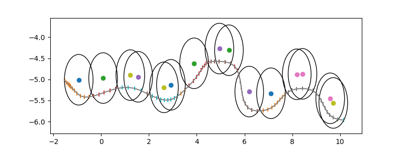
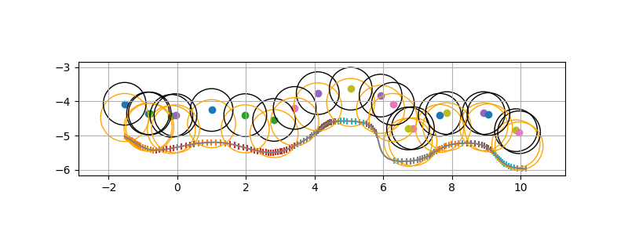
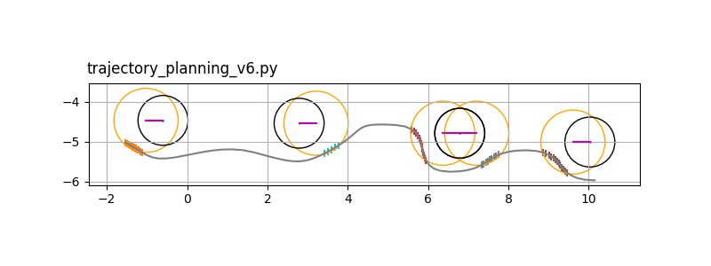
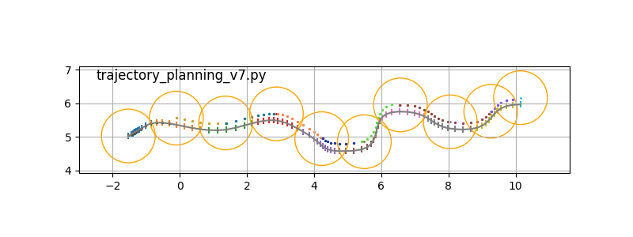
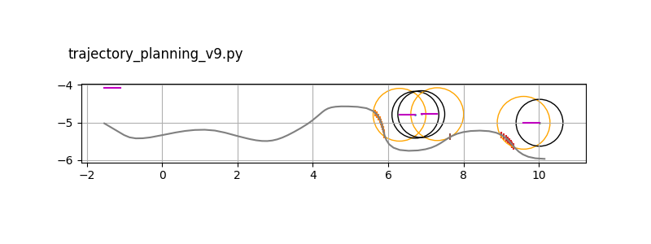

## :robot: Ridgeback Trajectory Planning

[:link:repository](https://github.com/JiyooonPark/ridgeback_trajectory_planning)

### File Description

| File Name | Description |Result | Status | Error |
| :-------: |:-----------:|:----:|:------:|:-----:|
|trajectory_planning.py | | | `complete`||
|trajectory_planning_v2.py | | | `ongoing`||
| trajectory_planning_v3.py| | | `complete`||
| trajectory_planning_v4.py| | | `complete`||
| trajectory_planning_v5.py| | | `complete`||
| trajectory_planning_v6.py| |  | `complete`||
| trajectory_planning_v7.py| |  | `complete`||
| trajectory_planning_v9.py| | | `complete`||
| trajectory_planning_v10.py| | | `complete`||
| trajectory_planning_v11.py| | | `complete`||
| trajectory_planning_v12.py| Candidate를 더 많이 추가하는것| | `complete`| Candidate가 함수형이 아니면 포함 못시키는 곳들이 있음|
| trajectory_planning_v13.py| iiwa만 빼내서 하는것| | `complete`||
| trajectory_planning_v14.py| | | `complete`||
| video_trajectory_planning_v10.py| | | `complete`||
| candidate_tools.py| | | `complete`||
| limit_simple_circle.py| | | `complete`||
| plot_input.py| | | `complete`||
| reachable.py| | | `complete`||
| square.py| | | `complete`||
| to_trajectory.py| | | `complete`||
| to_video.py| | | `complete`||
| tools.py| | | `complete`||